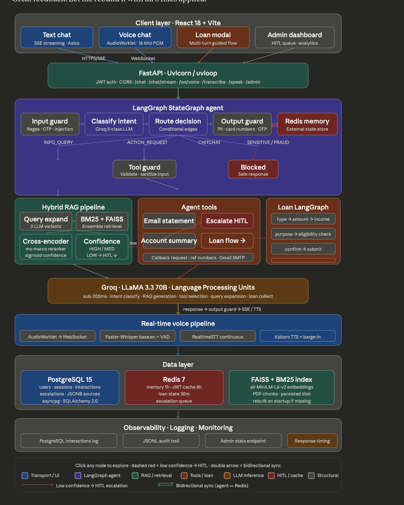

# 🏦 Banking Voice Agent

**Real-Time Voice-Enabled AI Assistant with RAG, Guardrails & Human-in-the-Loop**

A production-grade conversational AI system for banking workflows, combining **real-time voice interaction**, **retrieval-augmented generation (RAG)**, and **multi-layer safety guardrails**.

The system processes live audio, retrieves domain knowledge, executes structured workflows (e.g., loan applications), and escalates to humans when confidence is low.

---


## 🔥 Key Features

* 🎙️ **Real-Time Voice Interaction**

  * Streaming speech-to-text + text-to-speech
* 🧠 **RAG-Based Intelligence**

  * Hybrid retrieval (vector + keyword + reranking)
* 🤖 **LangGraph Agent Workflow**

  * Deterministic state-based execution
* 🛡️ **Multi-Layer Guardrails**

  * Input filtering + output sanitization
* 👤 **Human-in-the-Loop (HITL) Escalation**

  * Triggered on low confidence responses
* 💬 **Session Memory**

  * Redis-backed conversational state
* 📊 **Admin Dashboard**

  * Monitor usage, escalations, and analytics

---


## 🧠 System Architecture

```text
User Voice / Text
        ↓
[Speech-to-Text (Whisper)]
        ↓
[LangGraph Agent]
   ├── Intent Classification
   ├── Tool Routing
   ├── Loan Workflow (stateful)
   └── Memory (Redis)
        ↓
[RAG Pipeline]
   ├── Query Expansion
   ├── Hybrid Retrieval (FAISS + BM25)
   ├── Cross-Encoder Reranking
        ↓
[LLM (Groq - LLaMA3 70B)]
        ↓
[Guardrails]
   ├── Input Filter
   └── Output Scanner
        ↓
[Confidence Scoring]
   ├── High → Respond
   ├── Medium → Cautious Response
   └── Low → HITL Escalation
        ↓
[Response → Voice + UI]
```

---

## ⚙️ Tech Stack

| Layer           | Technology                  |
| --------------- | --------------------------- |
| Backend API     | FastAPI (async + WebSocket) |
| Agent Framework | LangGraph                   |
| LLM             | Groq (LLaMA 3 70B)          |
| RAG Retrieval   | FAISS + BM25 + CrossEncoder |
| Embeddings      | Sentence Transformers       |
| Speech-to-Text  | Faster-Whisper              |
| Real-time Audio | WebSockets + AudioWorklet   |
| Database        | PostgreSQL                  |
| Cache / Memory  | Redis                       |
| ORM             | SQLAlchemy (async)          |
| Frontend        | React + Vite                |

---

## 🚀 How It Works

### 1. Voice Processing

* Captures real-time audio via browser
* Converts speech → text using Whisper
* Streams input to backend via WebSockets

### 2. Intelligent Reasoning

* Intent classification determines flow:

  * Info query → RAG
  * Action request → tools / workflows
* LangGraph manages deterministic execution

### 3. RAG Pipeline

* Expands query using LLM
* Retrieves knowledge using:

  * BM25 (keyword)
  * FAISS (semantic)
* Reranks using cross-encoder

### 4. Response Generation

* LLM generates grounded response
* Guardrails sanitize output
* Confidence score determines escalation

### 5. Voice Output

* Converts response → speech
* Streams back to frontend in real time

---

## 💡 Engineering Highlights

* **Hybrid RAG pipeline** improves recall + precision
* **Cross-encoder reranking** for high-quality grounding
* **Stateful multi-turn workflows** (loan processing)
* **Confidence-based HITL escalation**
* **Streaming-first architecture** (low latency UX)
* **Strict separation of concerns**:

  * agent / retrieval / voice / guardrails

---

## 🧩 Core Capabilities

### 🏦 Banking Assistant

* Balance queries
* Policy Q&A
* Loan eligibility checks

### 📄 Loan Workflow Engine

* Multi-turn structured interaction
* Stateful execution via Redis
* Automated eligibility + EMI calculation

### 📊 Admin & Monitoring

* Track user interactions
* Review escalations
* Analyze intent distribution

---

## 📡 API Overview

### Chat

* `POST /api/v1/chat` → standard response
* `POST /api/v1/chat/stream` → streaming response

### Voice

* `POST /api/v1/transcribe` → audio → text
* `POST /api/v1/speak` → text → audio
* `WS /api/v1/ws/voice` → real-time voice

### Admin

* `GET /api/v1/admin/stats`
* `GET /api/v1/admin/escalations`
* `POST /api/v1/admin/escalations/{id}/resolve`

---


---

## 🛣️ Future Improvements

* Multi-language voice support
* Fine-tuned domain-specific LLM
* Distributed architecture (Kafka / event-driven)
* Advanced fraud detection layer
* Production-grade monitoring (Prometheus + Grafana)

---

## 🎯 Use Cases

* Banking customer support automation
* Voice-based financial assistants
* Call center augmentation
* Conversational fintech platforms

---

## ⚡ System Highlights

- Supports both SSE-based text streaming and real-time voice interaction
- Implements a graph-based agent with deterministic decision routing
- Uses hybrid retrieval (keyword + vector) with reranking for improved answer quality
- Incorporates guardrails and confidence-based escalation to prevent low-quality outputs
- Designed with separation of concerns across API, agent, retrieval, and data layers

---


**Designed to reflect real-world AI system engineering used in modern fintech and conversational AI platforms.**
